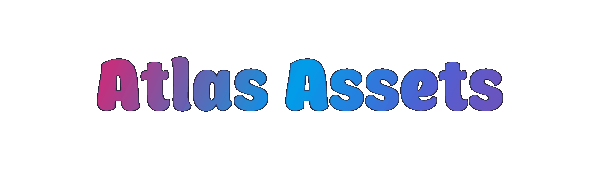
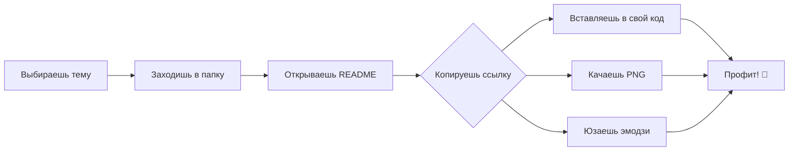

<div align="center">

# 🌟 **Atlas Assets** 🌟

### *"Твой личный архив магии для фронтенда"* ✨
<br>


<br>

[![Вау-эффект][wow-shield]](#)
[![Крутость][cool-shield]](#)
[![Магия][magic-shield]](#)
[![Хайп][hype-shield]](#)

<br>


</div>

<!-- Шилды (бейджи) -->
[wow-shield]: https://img.shields.io/badge/вау_✨-100%25-ff69b4?style=for-the-badge
[cool-shield]: https://img.shields.io/badge/крутость-💯_из_💯-brightgreen?style=for-the-badge
[magic-shield]: https://img.shields.io/badge/магии-∞-purple?style=for-the-badge
[hype-shield]: https://img.shields.io/badge/хайп-🔥_🔥_🔥-orange?style=for-the-badge

---

## 🎮 **Добро пожаловать в Атлас!**

> *Чё как, кодер? Устал от скучных квадратных иконок и хочешь добавить вайба в свои проекты? Ты по адресу!*

**Atlas Assets** — это **коллекция крутейших тематических наборов** иконок, стикеров и спрайтов для твоих фронтенд-проектов. Каждая папка — целый мир со своей атмосферой.

<div align="center">

</div>

---

## 📦 **Что внутри?**

Мы собрали для тебя **портал в разные вселенные**. Выбирай свою!

<br>

<div align="center">

| | **Вселенная** | **Описание** | **Иконок** | **Погнали** |
|:---:|:---|:---|:---:|:---:|
| 🌀 | **Фэнтези** | Маги, драконы, эльфы и прочая эпика | 30+ | [➡️ Телепорт](docs/images/fantasy/README.md) |
| 🃏 | **Clash Royal** | Карты, иконки, гифки и герои | 30+ | [➡️ Телепорт](docs/images/clash_royale/README.md) |
| 🔵 | **Покемоны** | Покемоны, тренера, значки и иконки | 300+ | [➡️ Телепорт](docs/images/pokemon/README.md) |
| 🤖 | **Киберпанк** | Неон, хакеры, роботы и будущее | 30+ | [➡️ Телепорт](.images/cyberpunk/README.md) |
| 🎲 | **Ретро-игры** | Пиксель-арт, 8-бит, ностальжи | 30+ | [➡️ Телепорт](.images/retro/README.md) |
| 🍣 | **Фуд-арт** | Еда, рестораны, доставка | 24+ | [➡️ Телепорт](.images/food/README.md) |
| 🐱 | **Милые зверята** | Котики, песики и всё такое | 31+ | [➡️ Телепорт](.images/animals/README.md) |
| 🌞 | **Лето и пляж** | Отпуск, серфинг, пальмы | 19+ | [➡️ Телепорт](.images/summer/README.md) |

</div>

<br>

> ⚡ **Скоро выйдут:** Космос, Хэллоуин, Аниме, Спорт, Мифические существа и многое другое!

---

## 🚀 **Как это работает?**

Всё проще пареной репы:



---

## 🔥 **Фишки, которые тебя зарядят**

<div align="center">

| | **Плюшка** | **Что дает?** |
|:---:|:---|:---|
| ⚡ | **Raw-ссылки** | Вставил в `` и работает |
| 🎨 | **CSS-анимации** | Для каждой темы готовые стили |
| 🎇 | **Web Components** | Кастомные теги для ленивых |
| 📱 | **Адаптивность** | Выглядят круто везде |
| 🆓 | **Бесплатно** | Для коммерции и пет-проектов |

</div>

---

## 🎯 **Пример использования за 5 секунд**

Допустим, хочешь мага из вселенной **Фэнтези**:

```html
<!-- 1. Идёшь в папку fantasy -->
<!-- 2. Берёшь raw-ссылку на elementalist.png -->
<!-- 3. Вставляешь в код -->


<style>
  @keyframes float {
    0%, 100% { transform: translateY(0); }
    50% { transform: translateY(-10px); }
  }
</style>
```

**Результат** прямо в README (не верь, а проверь!):


---

## 💅 **Анимации для твоих иконок**

Просто копируй эти стили в свой проект:

<details>
<summary>✨ Раскрыть магию</summary>

```css
/* Парящий эффект */
@keyframes float {
    0%, 100% { transform: translateY(0); }
    50% { transform: translateY(-10px); }
}
.float { animation: float 3s ease-in-out infinite; }

/* Мерцание */
@keyframes sparkle {
    0%, 100% { opacity: 0.5; filter: drop-shadow(0 0 2px gold); }
    50% { opacity: 1; filter: drop-shadow(0 0 15px gold); }
}
.sparkle { animation: sparkle 2s ease-in-out infinite; }

/* Вращение */
@keyframes spin {
    from { transform: rotate(0deg); }
    to { transform: rotate(360deg); }
}
.spin { animation: spin 10s linear infinite; }

/* Появление */
@keyframes slideIn {
    from {
        opacity: 0;
        transform: translateX(-50px);
    }
    to {
        opacity: 1;
        transform: translateX(0);
    }
}
.slide-in { animation: slideIn 0.5s ease-out; }
```
</details>

---

## 💫 **Как добавить свой набор?**

Хочешь стать частью Атласа и зашарить свои иконки? Форкни репозиторий и создай Pull Request с:

```bash
📁 твоя-тема/
 ├── 📄 README.md      # Красивое описание
 ├── 📁 images/        # Папка с иконками (PNG)
 └── 📁 examples/      # Примеры использования
```

Главное правило — **тематичность и качество**! Мы за объединение комьюнити 🔥

---

## 🎁 **Бонус-трек: Web Component**

А вот так можно использовать наши иконки с помощью кастомного тега:

```html
<script src="https://cdn.jsdelivr.net/gh/Gabryelf/Atlas-Assets/atlas-component.js"></script>

<atlas-icon 
    pack="fantasy" 
    name="elementalist" 
    size="64"
    animation="float"
    border="gold">
</atlas-icon>
```

<details>
<summary>🔧 Код компонента (копируй смело)</summary>

```javascript
class AtlasIcon extends HTMLElement {
    connectedCallback() {
        const pack = this.getAttribute('pack') || 'fantasy';
        const name = this.getAttribute('name') || 'elementalist';
        const size = this.getAttribute('size') || '64';
        const animation = this.getAttribute('animation') || '';
        const border = this.getAttribute('border') || 'none';
        
        this.innerHTML = `
            
        `;
    }
}
customElements.define('atlas-icon', AtlasIcon);
```
</details>

---

## 🤝 **Контрибьюторы**

Эти ребята уже с нами:

<!-- ВРЕМЕННО: Здесь будут аватарки контрибьюторов -->
<div align="center">
  <a href="https://github.com/Gabryelf"></a>
  <!-- Твой аватар может быть здесь! -->
</div>

---

<div align="center">
  
### *"Пусть твой код будет чище, чем эльфийская магия, а дедлайны — побеждены, как драконы!"* 🐉


<br>
<br>

**⭐ Не забудь поставить звезду, если зашло! ⭐**

<br>
**Есть идеи или хочешь предложить тему? Пиши в Issue!**
 [Хочешь поделиться своим мнением?](https://github.com/Gabryelf/Atlas-Assets/issues)

<br>

</div>

---

## 🎸 **P.S. Музыка для кода**

Кодишь под этот README? Вруби для настроения:
🎧 [Lo-fi Hip Hop](https://www.youtube.com/watch?v=5qap5aO4i9A) | 🎧 [Epic Fantasy Music](https://www.youtube.com/watch?v=5VrLwUfA5o4) | 🎧 [Synthwave](https://www.youtube.com/watch?v=0VqTemD0k5U)

---

## 🏁 **Вот и всё, бро!**

А теперь **погнали исследовать вселенные**! 👇

<div align="center">

| ✨ [Фэнтези](./fantasy/README.md) | 🤖 [Киберпанк](./cyberpunk/README.md) | 🎲 [Ретро](./retro/README.md) | 🍣 [Фуд-арт](./food/README.md) | 🐱 [Зверята](./animals/README.md) | 🌞 [Лето](./summer/README.md) |
|:---:|:---:|:---:|:---:|:---:|:---:|

</div>

---

### 🎇 **Удачного кодинга, герой!** 🎇
